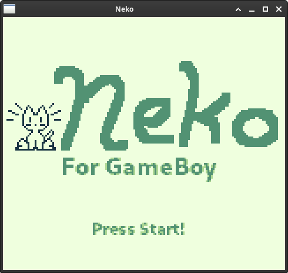
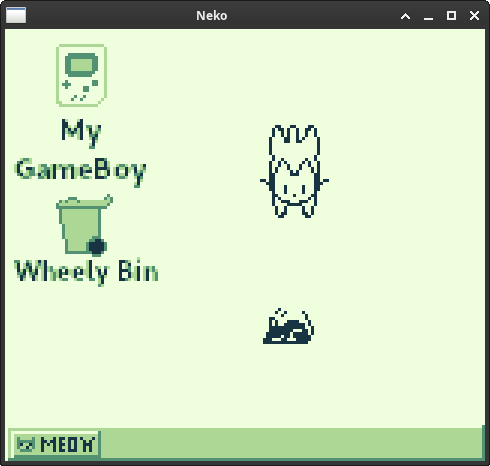
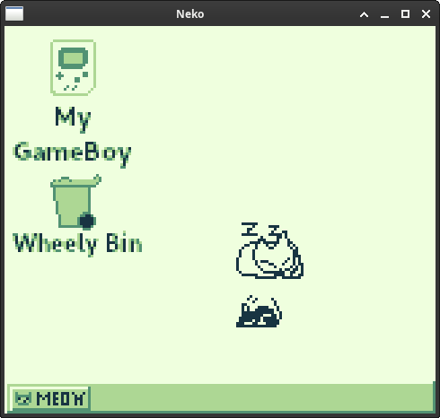
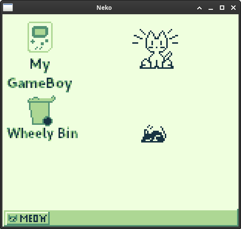

# GBNeko - A port of Neko for the Nintendo GameBoy

This is a very basic port of the classic "Neko" application for older machines. More information on this is available at the Wikipedia link here: https://en.wikipedia.org/wiki/Neko_(software)

It is very simple - move the mouse via the D-Pad, and the cat chases it. That's it.

This is early alpha software make in GB Studio and there are bound to be bugs. For bug reports please submit an Issue.

The sprites for Neko and the Player Mouse are not mine, and are sourced from this sheet, which states the sprites are public domain: https://cdn-learn.adafruit.com/assets/assets/000/108/510/original/projects_neko_cat_spritesheet.bmp?1643643842

ROM file for the game will be under /build.

 

 
